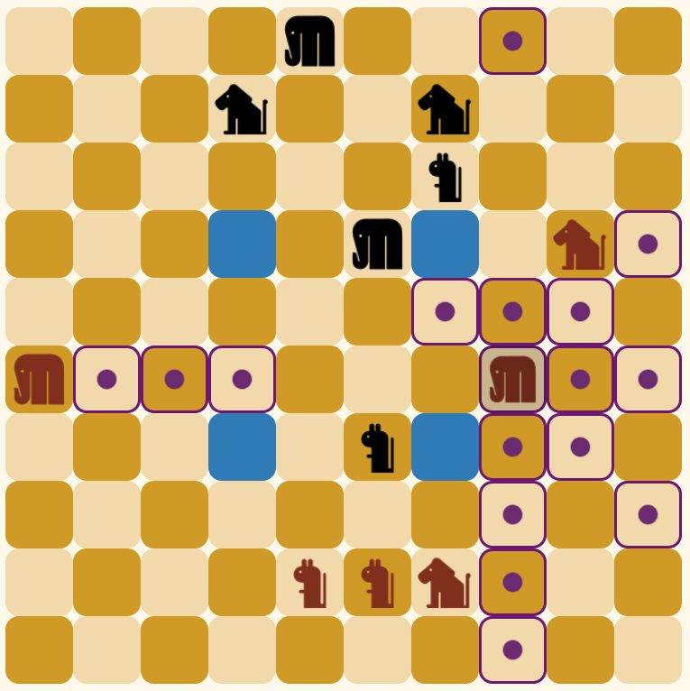

# Barca

Welcome to Barca, a game that at first sight might look like chess

  

The game was created using HTML, CSS, and Javascript. 
Click [here](https://alexandrelord.github.io/barca/) to play!

## History

Barca is a two-player strategy board game invented by Andrew Caldwell. It is named after the Carthaginian military commander Hannibal Barca who attacked ancient Rome with an army that included war elephants.

## General Gameplay

* Barca is a two-player stategy game played on a 10x10 checkerboard. 
* Each player controls 6 animals (2 elephants, 2 lions, and 2 mice).
* Players alternate moving one of their animals per turn.
* The goal of the game is to control 3 of the 4 oasis at the end of a turn.

## Rules

### Animal Movements
Mouse moves along rows and columns.

Lion moves on diagonals.

Elephant moves along rows, columns and diagonals.

### Movement Restrictions
* Animals can move any number of squares on the board but cannot jump over other animals.
* A player's animals may occupy squares next to each other.
* An animal may not move to a square adjacent to an opposing animal that it fears. Squares adjacent to an animal include all those within one square of the animal; horizontally, vertically and diagonally.

* An animal is said to be scared when it is adjacent to an animal it fears. For example, if a player moves a lion adjacent to the opposing player's mouse, then that mouse becomes scared.

* On a player's turn, if any of the player's animals are scared, then one of them must be moved to a safe square, if possible.

### Scared Animals
* Each animal is afraid of one opposing animal type.
* The elephant fears the mouse.
* The lion fears the elephant.
* The mouse fears the lion.

### Winning
* The four blue squares near the center of the board are the oasis. The first player to get three of their animals on the oasis at the end of their turn wins.

## Future Updates
* Flip board on a player's turn.
* Add timed game play.
* Add visual rules next to game.
* 